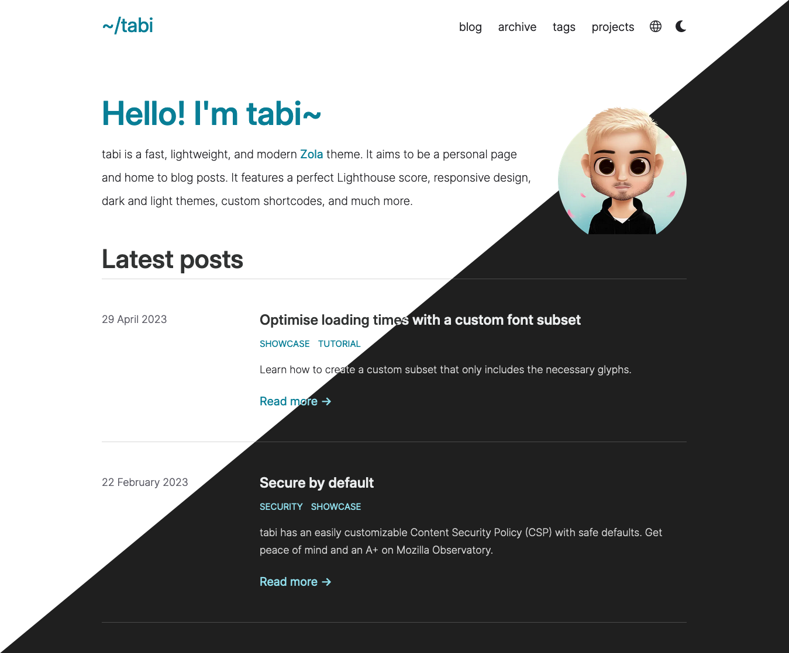
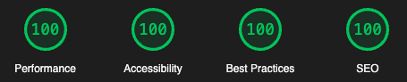

# tabi

A fast, lightweight, and modern [Zola](https://getzola.org) theme. It aims to be a personal page and home to blog posts.

See a live preview [here](https://welpo.github.io/tabi).

> tabi (旅): Journey.



Tabi has a perfect score on Google's Lighthouse audit:



## Features

- [X] Dark and light themes. Defaults to the OS setting, with a switcher in the navigation bar.
- [X] Perfect Lighthouse score (Performance, Accessibility, Best Practices and SEO).
- [X] [KaTeX](https://katex.org/) support.
- [X] All JavaScript (theme switcher and KaTeX) can be fully disabled.
- [X] Projects page.
- [X] Archive page.
- [x] Tags.
- [x] Social links.
- [X] Code syntax highlighting.
- [X] [Custom shortcodes](./templates/shortcodes/).
- [X] Customizable secure headers.

See the project's roadmap [here](https://github.com/users/welpo/projects/1).

## Quick start

```bash
git clone git@github.com:welpo/tabi.git
cd tabi
zola serve
# open http://127.0.0.1:1111/ in the browser
```

## Inspiration

This theme was inspired by:
- [shadharon](https://github.com/syedzayyan/shadharon). tabi started as a fork of [syedzayyan](https://github.com/syedzayyan)'s theme.
- [tailwind-nextjs-starter-blog](https://github.com/timlrx/tailwind-nextjs-starter-blog)
- [tale-zola](https://github.com/aaranxu/tale-zola)
- [internetVin's blog](https://internetvin.ghost.io)

## Contributing

Please do! Take a look at the [Contributing Guidelines](/CONTRIBUTING.md) to learn more.

## License

The code is available under the [MIT license](./LICENSE).
