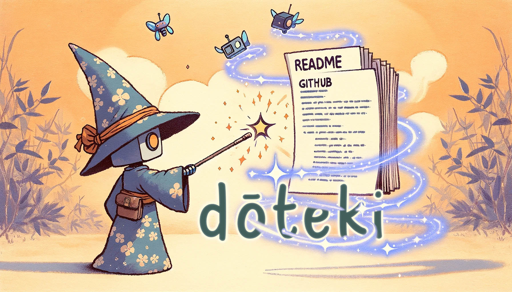

+++
title = "dōteki"
description = "Afegeix contingut dinàmic al teu perfil de GitHub amb un sistema intuïtiu de plugins."
weight = 30

[taxonomies]
tags = ["GitHub Actions", "automatització", "Python"]

[extra]
local_image = "projects/doteki/doteki_logo.webp"
social_media_card = "social_cards/projects_doteki.jpg"
canonical_url = "https://osc.garden/ca/projects/doteki/"
+++

[**dōteki**](https://doteki.org/) és una eina dissenyada per donar vida als perfils de GitHub afegint contingut dinàmic de manera senzilla. Amb un arxiu de configuració TOML intuïtiu i un sistema de plugins versàtil, **dōteki** permet als usuaris mostrar contingut recent i automatitzat directament als seus perfils de GitHub.

#### [GitHub](https://github.com/welpo/doteki) • [Lloc web](https://doteki.org/) • [Documentació](https://doteki.org/docs/) {.centered-text}

## Per què dōteki?

**dōteki** destaca per la seva simplicitat i potència. És altament personalitzable i extensible, i està dissenyat per ser fàcil de configurar i utilitzar.

## Característiques clau

- **Plug-and-Play**: Afegeix marcadors al teu README i utilitza un arxiu TOML per incorporar seccions de contingut dinàmic al teu perfil de GitHub.
- **Sistema de plugins extensible**: Des de mostrar les últimes publicacions del teu blog fins a compartir la música que has estat escoltant, el sistema de plugins permet infinites possibilitats. No trobes un plugin que s'ajusti a les teves necessitats? [Crea el teu propi](https://doteki.org/docs/developer-guide/plugin-standard)!
- [**Documentació exhaustiva**](https://doteki.org/docs/) amb informació detallada sobre com configurar i utilitzar **dōteki** i els seus plugins. Inclou [instruccions clares per als desenvolupadors](https://doteki.org/docs/developer-guide/) que vulguin contribuir al projecte.
- **Preparat per a l'automatització**: Utilitza l'[Acció de GitHub](https://github.com/welpo/doteki-action) per mantenir el teu perfil sempre actualitzat.

## Refresca el teu perfil de GitHub

Aprofita les capacitats dinàmiques de **dōteki** i transforma el teu perfil de GitHub en un aparador del teu treball més recent, pensaments i interessos.

[Configura **dōteki** en menys de 5 minuts](https://doteki.org/) i dóna vida al teu perfil de GitHub.

