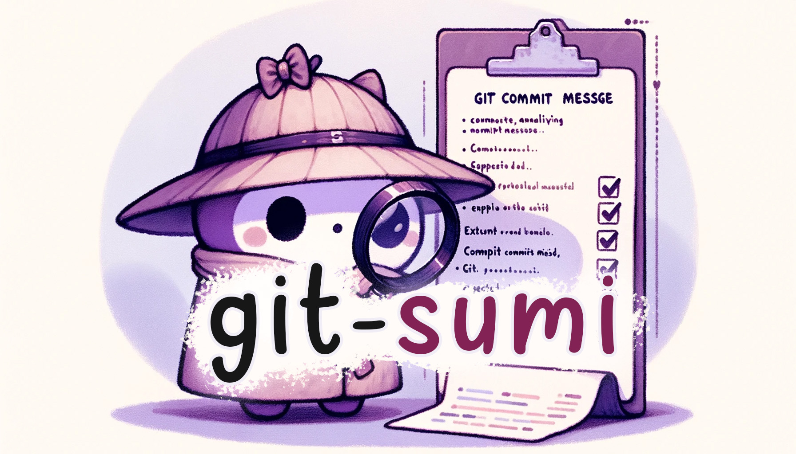

+++
title = "git-sumi"
description = "El linter de missatges de commit no opinat basat en Rust."
weight = 10

[extra]
local_image = "projects/git-sumi/git-sumi_logo.webp"
social_media_card = "social_cards/projects_git-sumi.jpg"
canonical_url = "https://osc.garden/ca/projects/git-sumi/"
+++

**git-sumi** és un linter de missatges de commit no opinat escrit en Rust. És una eina flexible per complir els teus estàndards de missatges de commit, facilitant missatges consistents i fàcilment automatitzables.


<video controls src="https://cdn.jsdelivr.net/gh/welpo/git-sumi@main/assets/git-sumi_demo.mp4" title="demo de git-sumi"></video>


#### [GitHub](https://github.com/welpo/git-sumi) • [Lloc web](https://sumi.rs/) • [Documentació](https://sumi.rs/docs/) {.centered-text}

## Característiques principals

- **Regles personalitzables**: Configura git-**sumi** per satisfer els requisits específics de cada projecte. Configura regles per a Conventional Commits, límits de longitud, ús de Gitmoji i més a través d'un senzill arxiu de configuració TOML.
- **Informe d'errors clar**: Proporciona un informe d'errors detallat, fent que la correcció sigui senzilla i educativa.
- **Integració sense fissures**: Sent un únic binari, git-**sumi** s'integra fàcilment en el teu flux de treball. Fins i tot pots utilitzar l'[Acció de GitHub](https://github.com/welpo/git-sumi-action) per validar els teus commits (o títols de PR) sense necessitat d'instal·lar res localment.

## Bones pràctiques de desenvolupament

- **Ampla cobertura del codi**: Més del 95% de cobertura de línies i una cobertura de característiques exhaustiva garanteixen la robustesa de git-**sumi**.
- **Integració [contínua](https://github.com/welpo/git-sumi/blob/main/.github/workflows/ci.yml) i [publicació](https://github.com/welpo/git-sumi/blob/main/.github/workflows/release.yml)**: Fluxos de treball automatitzats per provar, integrar i publicar asseguren que cada versió de git-**sumi** estigui completament provada i llesta per al seu ús.
- **Contribucions de la comunitat**: Fomenta les contribucions de la comunitat de tot tipus, amb un enfocament acollidor tant per als nouvinguts com per als desenvolupadors experimentats.
- [**Documentació exhaustiva**](https://sumi.rs/docs/) per començar amb git-**sumi** i comprendre les seves característiques i capacitats.

## Comença a millorar les teves pràctiques de commit avui

Fes el primer pas cap a la transformació de les teves pràctiques de commit. La combinació de flexibilitat, retroalimentació detallada i fàcil integració de git-**sumi** el converteix en l'opció perfecta per a equips i individus que busquen millorar els seus missatges de commit.

[Descobreix **git-sumi**](https://sumi.rs/) i fes-lo part del teu kit d'eines de desenvolupament.

