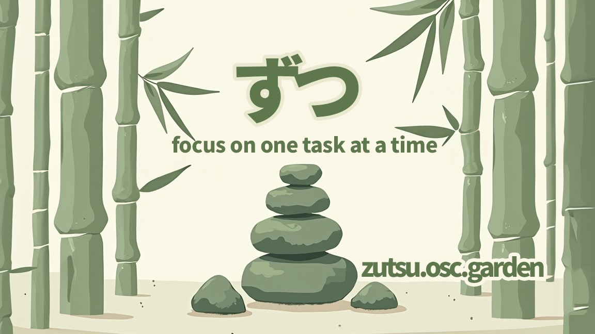

+++
title = "ずつ (zutsu)"
description = "A private minimalist task management app."
weight = 32

[taxonomies]
tags = ["interactive", "productivity", "web app", "web", "JavaScript"]

[extra]
local_image = "projects/zutsu/zutsu_logo.webp"
canonical_url = "https://osc.garden/projects/zutsu/"
social_media_card = "social_cards/projects_zutsu.jpg"
+++


<video controls src="https://cdn.jsdelivr.net/gh/welpo/zutsu/assets/ずつ_demo.mov" title="zutsu demo"></video>


#### [Try it now](https://zutsu.osc.garden) • [GitHub](https://github.com/welpo/zutsu) • [Blog post](https://osc.garden/blog/zutsu-offline-task-planner-web-app/) {.centered-text}

<ruby>ず<rt>zu</rt>つ<rt>tsu</rt></ruby> is a task management web app designed to help you focus on one task at a time. The name comes from <ruby>一つ<rt>hitotsu</rt>ずつ<rt>zutsu</rt></ruby> which means "one at a time" in <ruby>日本語<rt>Japanese</rt></ruby>.

## Why?

I wanted to replace inflexible calendar events for study sessions with something simple and adaptable. No third-party apps, no cloud sync —just a focused space for task management.

## Features

### Core

- Task management with drag-and-drop reordering
- Timer with customizable duration for each task
- Private & offline—no accounts, tracking, or server storage
- Import/export task lists (JSON)

### Utilities

- Pomodoro timer
- Activity calendar (30-day view)
- Counter & stopwatch
- Note-taking space
- Random choice makers

### Quality of life

- Dark and light theme support
- Browser and sound notifications
- Keyboard shortcuts
- Responsive design

